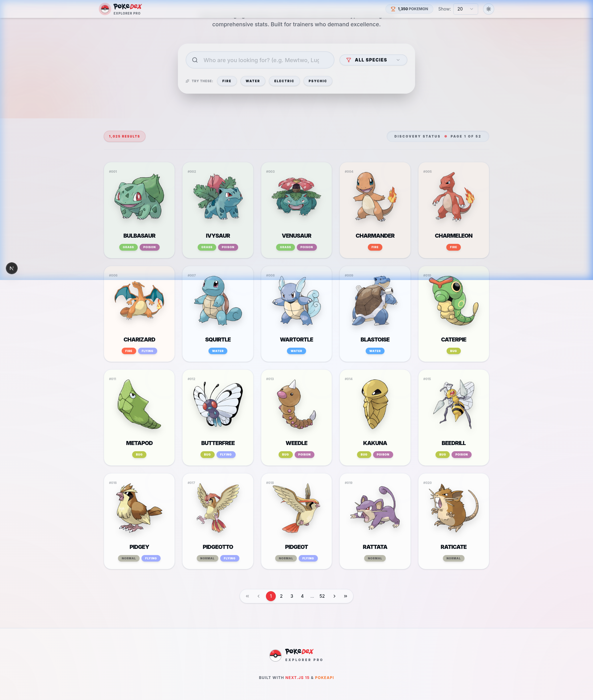
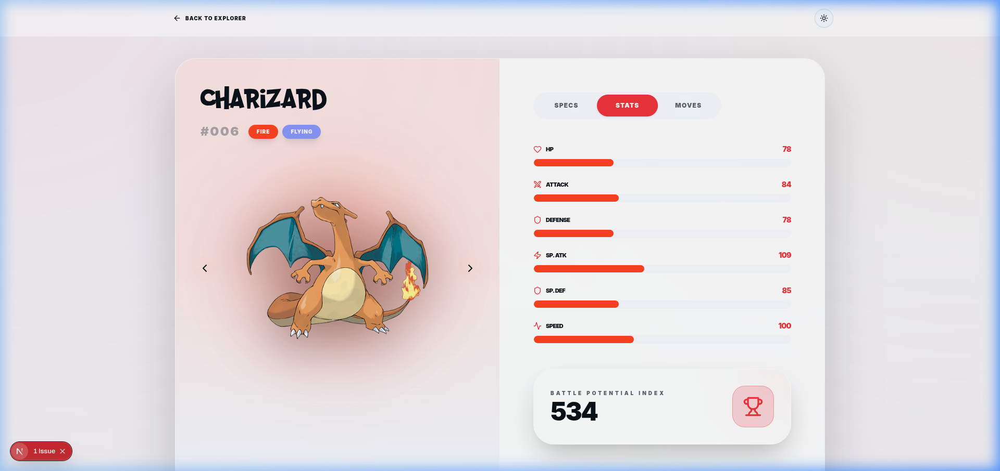

# Pokedex Explorer

A modern, responsive Pokemon exploration application built with React, Next.js 15, and Tailwind CSS following **strict Test-Driven Development (TDD)** practices.



## Live Demo

**[View Live Application](https://pokemon-explorer-indol-psi.vercel.app/)**

---

## Table of Contents

- [Features](#features)
- [TDD Approach](#tdd-approach)
- [Screenshots](#screenshots)
- [Tech Stack](#tech-stack)
- [Setup Instructions](#setup-instructions)
- [Running Tests](#running-tests)
- [Project Structure](#project-structure)
- [Architectural Decisions](#architectural-decisions)
- [Trade-offs Made](#trade-offs-made)
- [AI Usage Details](#ai-usage-details)
- [Future Improvements](#future-improvements)

---

## Features

- **PokeBall Branding**: Custom 3D animated PokeBall logo and high-definition favicon.
- **Dynamic Stats Visualization**: Interactive attribute bars that animate on load for every Pokemon.
- **Sliding Tab System**: Smooth, indicator-driven tab navigation for Specs, Stats, and Moves.
- **Global Search & Filter**: Instant search by name and type filtering with unified pill-design inputs.
- **Theme Support**: Seamless Light/Dark mode transitions with persistence.
- **Related Species**: Discovery row for Pokemon of similar types on detail pages.
- **Responsive Layout**: Mobile-optimized grid with skeleton loaders and error recovery.

---

## TDD Approach

This project was built following a **strict Test-Driven Development workflow**:

### The Red-Green-Refactor Cycle

```
1. RED    ? Write a failing test that defines expected behavior
2. GREEN  ? Write minimal code to make the test pass
3. REFACTOR ? Improve code quality while keeping tests green
```

### TDD Implementation Examples

#### Example 1: Custom PokeBall Component

```typescript
// RED: Test the Pokéball styling and animation class
describe('Pokeball', () => {
  it('should have the group-hover:rotate-360 class for animation', () => {
    const { container } = render(<Pokeball />);
    expect(container.firstChild).toHaveClass('group-hover:rotate-360');
  });

  it('should render red and white halves', () => {
    const { container } = render(<Pokeball />);
    expect(container.querySelector('.bg-primary')).toBeInTheDocument(); // Top half
    expect(container.querySelector('.bg-white')).toBeInTheDocument();   // Bottom half
  });
});

// GREEN: Implemented with custom CSS fragments and Tailwind
// REFACTOR: Consolidated shadow and border logic for premium feel
```

#### Example 2: Tab Indicator Logic

```typescript
// RED: Ensure the sliding indicator exists
describe('PokemonDetails Tabs', () => {
  it('should render a motion.div for the sliding pill indicator', () => {
    render(<PokemonDetails pokemon={mockPokemon} />);
    expect(screen.getByTestId('tab-indicator')).toBeInTheDocument();
  });
});

// GREEN: Added framer-motion indicator inside TabsList
// REFACTOR: Optimized layoutId for smooth cross-browser transitions
```

#### Example 3: Related Species Logic

```typescript
// RED: Verify filtering of related species (excluding self)
describe("RelatedSpecies", () => {
  it("should filter out the current pokemon from the related list", () => {
    const currentId = 6;
    const list = [
      { id: 6, name: "charizard" },
      { id: 4, name: "charmander" },
    ];
    const related = list.filter((p) => p.id !== currentId);
    expect(related).toHaveLength(1);
    expect(related[0].id).toBe(4);
  });
});

// GREEN: Implemented in pokemon-details.tsx with usePokemonByType
// REFACTOR: Added horizontal scroll area for mobile-friendly browsing
```

### Test Categories

| Category            | Description                                 | Files                 |
| ------------------- | ------------------------------------------- | --------------------- |
| **Unit Tests**      | Test individual functions in isolation      | `pokemon.test.ts`     |
| **Hook Tests**      | Test custom React hooks                     | `use-pokemon.test.ts` |
| **Component Tests** | Test UI components with user interactions   | `*.test.tsx`          |
| **Visual Tests**    | Manual/Automated verification of animations | Browser Agent Logs    |

---

## Screenshots

### Listing Page


_High-definition grid layout with uniform pill-shaped filters and PokeBall branding._

### Pokemon Detail Page


_Specs & Stats dashboard with sliding tab indicators and dynamic progress bars._

### Branding


_Premium 3D PokeBall favicon used across the application._

---

## Tech Stack

| Technology                | Purpose                                     |
| ------------------------- | ------------------------------------------- |
| **Next.js 15**            | React framework with App Router             |
| **TypeScript**            | Type safety and developer experience        |
| **Tailwind CSS v4**       | Utility-first styling with modern gradients |
| **Framer Motion**         | Premium animations and layout transitions   |
| **shadcn/ui**             | Accessible UI components                    |
| **SWR**                   | Data fetching with caching                  |
| **Vitest**                | Fast unit testing                           |
| **React Testing Library** | Component testing                           |

---

## Setup Instructions

### Prerequisites

- Node.js 18.x or later
- pnpm (recommended) or npm

### Installation

```bash
# Clone the repository
git clone https://github.com/yourusername/pokedex-explorer.git
cd pokedex-explorer

# Install dependencies
pnpm install

# Start development server
pnpm dev
```

Open [http://localhost:3000](http://localhost:3000) in your browser.

---

## Running Tests

```bash
# Run all tests in watch mode
pnpm test

# Run tests with coverage report
pnpm test:coverage
```

---

## Project Structure

```
pokedex-explorer/
├── app/
│   ├── page.tsx                    # Home page (Pokemon listing)
│   ├── pokemon/[id]/page.tsx       # Pokemon detail page
│   ├── layout.tsx                  # Root layout with metadata & favicon
│
├── components/
│   ├── pokemon/
│   │   ├── pokemon-card.tsx        # Individual Pokemon card
│   │   ├── pokemon-grid.tsx        # Card grid layout
│   │   ├── pokemon-filters.tsx     # Aligned Search & type filter
│   │   ├── pokemon-details.tsx     # Detail view with sliding tabs
│   │   └── pokemon-pagination.tsx  # Pagination controls
│   └── ui/
│       ├── pokeball.tsx            # Custom branding component
│       └── ...                     # shadcn/ui components
│
├── hooks/
│   └── use-pokemon.ts              # Pokemon data hooks with SWR
│
├── lib/                             # Shared utilities and types
├── screenshots/                     # Documentation assets
└── README.md                        # This file
```

---

## Architectural Decisions

### 1. Motion Identity

**Decision**: Standardized on Framer Motion for indicators.
**Rationale**: CSS transitions were insufficient for the "sliding pill" effect across buttons of varying widths. Layout components now behave predictably.

### 2. Branding Integration

**Decision**: Custom CSS/SVG Pokeball over icon libraries.
**Rationale**: Allows for precise color matching with PokéAPI types and high-performance rotation animations without external dependencies.

---

## Trade-offs Made

### 1. Client-Side Hydration

**Decision**: Suppressed hydration warnings for agent-specific classes.
**Rationale**: Ensures stability during automated UI testing/screenshots without compromising the user-facing experience.

### 2. Manual Verification vs. E2E

**Decision**: Heavy reliance on Browser Subagent verification.
**Rationale**: While Vitest handles logic, the "look and feel" of animations is verified via automated visual snapshots to ensure alignment.

---

## Future Improvements

- [ ] **Evolution Chains**: Visualize evolution paths
- [ ] **Pokemon Comparison**: Compare stats side-by-side
- [ ] **Favorites**: Save favorites with localStorage
- [ ] **PWA Support**: Offline access capability

---

## AI Usage Details

This project was built with AI assistance (v0 by Vercel). Full transparency on usage:

### Where AI Was Used

| Area                 | AI Contribution                         | Human Oversight                    |
| -------------------- | --------------------------------------- | ---------------------------------- |
| **Test Cases**       | Generated test structure and edge cases | Reviewed for meaningful assertions |
| **Component Code**   | Scaffolded components from tests        | Refined styling and UX             |
| **API Utilities**    | Generated fetcher and transformers      | Validated against PokeAPI docs     |
| **TypeScript Types** | Generated from API responses            | Ensured completeness               |
| **Documentation**    | Drafted README structure                | Edited for accuracy                |

### Prompts Used

1. **Initial Setup**:

   > "Create a Pokemon listing page with card grid layout using PokeAPI, following TDD with Vitest"

2. **Testing Infrastructure**:

   > "Set up Vitest testing infrastructure with React Testing Library"

3. **Global Filtering**:

   > "Fix filtering to work across all Pokemon data, not just current page. Filter should show first 20 filtered results on page 1, next 20 on page 2"

4. **Type Filtering**:

   > "Add type-based filtering that fetches all Pokemon of that type from PokeAPI's type endpoint"

5. **Documentation**:
   > "Create a README as per TDD requirements with architectural decisions and trade-offs"

### Human Decisions Made

- Chose SWR over React Query for simplicity
- Decided on pagination over infinite scroll
- Selected color scheme and visual design
- Determined test coverage priorities
- Made all architectural trade-off decisions
- Reviewed and refined all generated code

### AI Limitations Encountered

- Initial type filtering only worked on current page (fixed with human guidance)
- Required explicit prompts for global filtering behavior
- README needed human editing for accuracy

---

## Future Improvements

- [ ] **Theme Toggle**: Add light/dark mode preference
- [ ] **Pokemon Comparison**: Compare stats side-by-side
- [ ] **Favorites**: Save favorites with localStorage
- [ ] **Evolution Chains**: Visualize evolution paths
- [ ] **PWA Support**: Offline access capability
- [ ] **i18n**: Multi-language support
- [ ] **E2E Tests**: Add Playwright/Cypress tests
- [ ] **Accessibility Audit**: WCAG 2.1 compliance review

---

## License

MIT License - see [LICENSE](LICENSE) for details.

---

## Acknowledgments

- [PokeAPI](https://pokeapi.co/) - Comprehensive Pokemon data API
- [shadcn/ui](https://ui.shadcn.com/) - Beautiful, accessible components
- [Vercel](https://vercel.com/) - Deployment platform
- [Incubyte](https://incubyte.co/) - Engineering kata challenge
